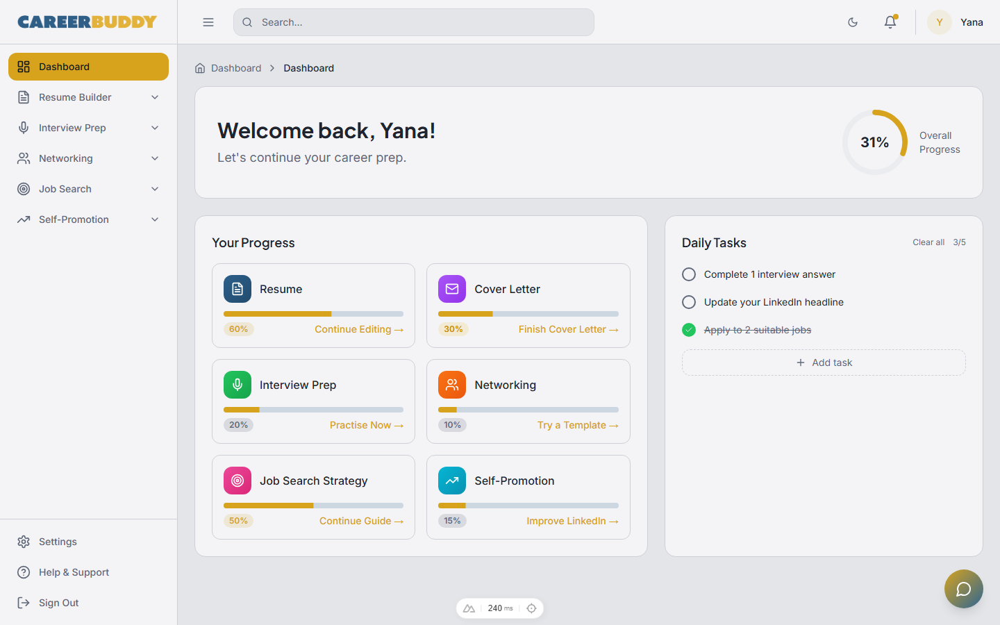
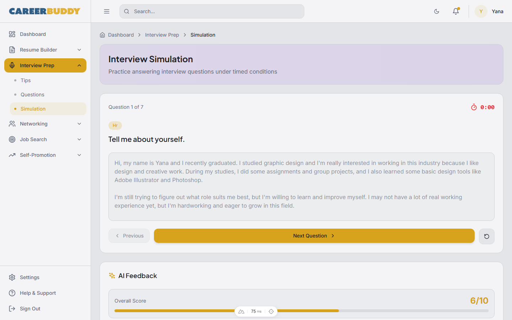
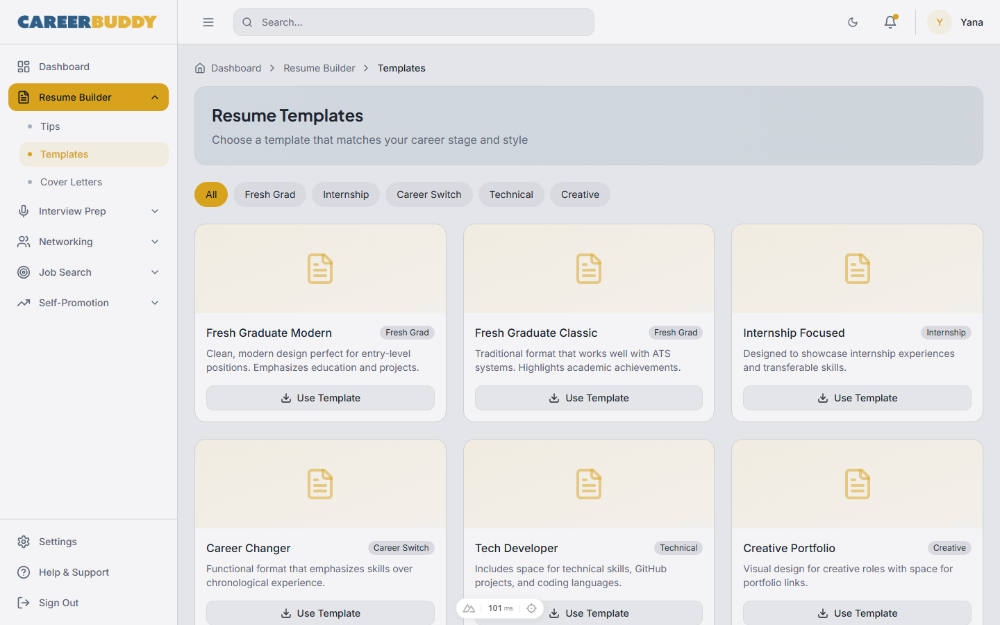

# Career Buddy

**Live demo: <https://carreer-buddy-proto.vercel.app>**

A frontend-only prototype of Career Buddy — a career-preparation platform for Malaysian youth
aged 18–30. A public landing page plus a mock-auth app shell with dashboard, AI career chat,
resume builder, interview prep (including an AI simulation), job search, networking, and
self-promotion modules. All data is mock data served from composables — no backend, no
database, no `.env`. Log in with `admin` / `admin` to explore the app shell.

> **New developer? Start with [`.docs/tldr.md`](.docs/tldr.md)** — every doc summarised on one
> page. The full guide lives in [`.docs/`](.docs/README.md).

## Screenshots

| Dashboard | Interview simulation | Resume builder |
| --- | --- | --- |
|  |  |  |

## Prerequisites

| Tool | Version | Installed by |
| --- | --- | --- |
| PowerShell + winget | Windows 10/11 stock | — (the only true prerequisites) |
| Git | any recent | `setup.ps1` |
| Node.js + npm | LTS (verified on v24) | `setup.ps1` |
| just | any recent | `setup.ps1` |
| Claude Code CLI | latest | `setup.ps1` (optional, for AI-assisted dev) |

## Quick start

```powershell
# 1. One-time machine setup (idempotent — safe to re-run)
pwsh ./setup.ps1

# 2. Close and reopen PowerShell so PATH updates land
# 3. Install dependencies (npm ci + patch-package + nuxt prepare)
just install

# 4. Start the dev server
just start
```

The app is now at **http://localhost:8114**. Stop it with `just stop`.

## Commands

Run `just` with no arguments to list every recipe. The ones you'll use daily:

| Command | What it does |
| --- | --- |
| `just install` | Install dependencies (`npm ci`; runs patch-package + `nuxt prepare`) |
| `just start` | Dev server on http://localhost:8114 in a background window |
| `just dev` | Dev server in the foreground (Ctrl+C to stop) |
| `just stop` | Stop only THIS repo's node processes |
| `just build` | Production build (Nitro server bundle in `.output/`) |
| `just preview` | Serve the production build on http://localhost:8114 (after `just build`) |
| `just test` | Run ALL Vitest tests once (unit + functional — 916 tests) |
| `just test-unit` | Unit tests only (`tests/unit` — composables) |
| `just test-functional` | Functional tests only (`tests/functional` — components) |
| `just test-coverage` | ALL Vitest tests with v8 coverage, enforcing the thresholds in `vitest.config.ts` |
| `just e2e` | Playwright end-to-end specs (boots its own dev server on :3000) |
| `just typecheck` | Full-project TypeScript check (`npx nuxt typecheck`) — expect 0 errors |
| `just verify` | Full quality gate: `just test-coverage` + `just typecheck` |
| `just verify-all` | `just verify` + `just e2e` (minutes; needs `npx playwright install`) |
| `just claudex` | Launch Claude Code (Sonnet, all permissions) |

## Troubleshooting

### `npm run test` hangs and never exits

Bare `npm run test` runs `vitest` in watch mode. Use `just test` (which forces `--run`) or the
scoped scripts `npm run test:unit` / `npm run test:functional`.

### Dev server takes a long time before the page loads

The first request after `just start` triggers Vite transforms — allow 30–120 seconds before
`http://localhost:8114` returns 200. Poll with
`curl.exe -s -o NUL -w "%{http_code}" http://localhost:8114/` rather than assuming failure.
Also use `localhost`, not `127.0.0.1` — on Windows the dev server binds the IPv6 loopback.

### `just typecheck` reports errors

The typecheck baseline is **zero errors** (the historical 26-error baseline was cleared in
2026-08). Any error `just typecheck` reports is a regression introduced by your change — fix
it before pushing (`just verify` runs tests + typecheck together); see
[`.docs/06-troubleshooting/common-issues.md`](.docs/06-troubleshooting/common-issues.md).

### `npm run test:e2e` fails immediately

Playwright needs its browsers once: `npx playwright install`. The e2e config boots its own dev
server on `localhost:3000` (independent of the :8114 kit server) and runs five browser
projects — use `--project=chromium` for a faster local run.

More in [`.docs/06-troubleshooting/common-issues.md`](.docs/06-troubleshooting/common-issues.md).

## Project layout

```
career-buddy/
  nuxt.config.ts              # modules, SEO/sitemap, routeRules, fonts
  tailwind.config.ts, tsconfig.json, vitest.config.ts, playwright.config.ts
  error.vue                   # active error page (app/ pair is unused — see .docs FAQ)
  pages/                      # file-based routes: landing, auth, dashboard, chat, help,
                              # settings, about/contact/privacy + resume/, interview/,
                              # job-search/, networking/, self-promotion/
  layouts/                    # default (navbar+footer), dashboard (sidebar)
  components/                 # per-module folders + shared/ + ui/ (shadcn-vue) + landing/
  composables/                # one useX.ts per module — ALL app data is mocked here
  lib/utils.ts                # cn() class merge
  assets/css/, public/        # global styles; favicons, og-image, robots.txt
  patches/                    # patch-package (applied on npm install)
  tests/                      # unit/ + functional/ (Vitest) + e2e/ (Playwright)
  docs/plans/, PLAN.md        # historical design notes
  .docs/                      # developer documentation (start at .docs/tldr.md)
```
